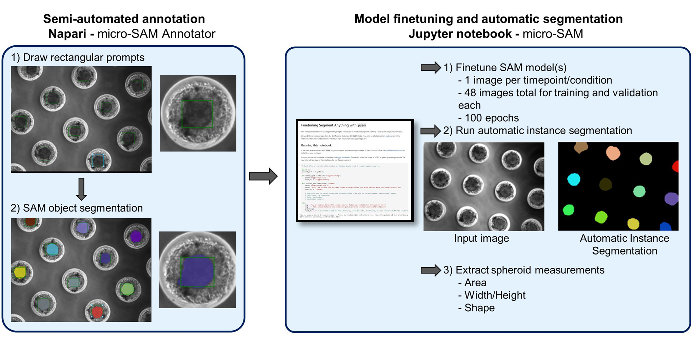

# Spheroid Analysis with micro-sam

This repository contains scripts for analysis of spheroids using [micro-sam](https://github.com/computational-cell-analytics/micro-sam).

## Scripts
- convert_RGB_to8bit_.ijm
- Make_overlays_labelMap_.ijm
- Make_PDX_montages_.ijm
- sam_finetuning_own.ipynb

## Contact
